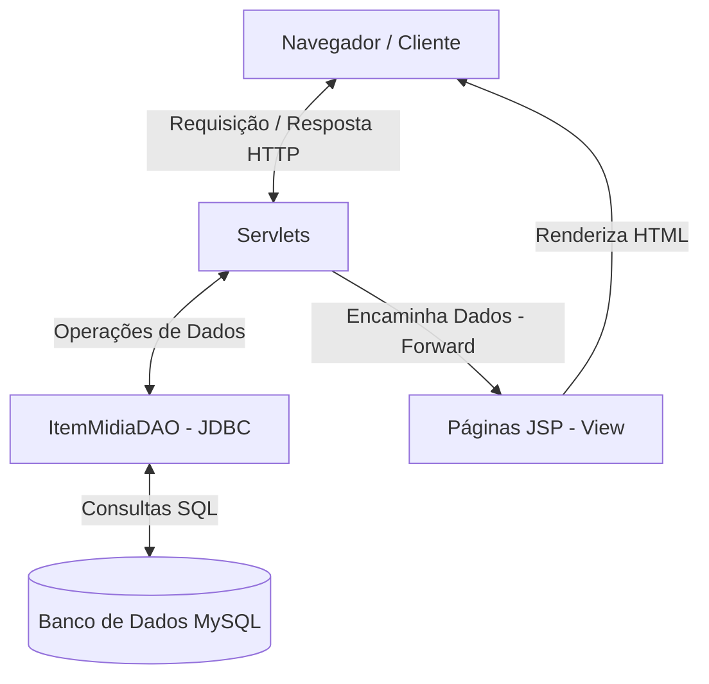

# Catálogo de Mídias - Aplicação Web Java

Aplicação web em Java para gerenciamento e catalogação de itens de mídia (livros e filmes), desenvolvida como projeto prático transdisciplinar em Ciência da Computação.

---

## Tecnologias Utilizadas

* **Linguagem**: Java (JDK)
* **Web**: Java Servlets (`javax.servlet`) & JavaServer Pages (JSP)
* **Persistência**: JDBC (Java Database Connectivity)
* **Banco de Dados**: MySQL
* **Estilização**: CSS3
* **Servidor**: Apache Tomcat

---

## Estrutura e Arquitetura do Sistema

O projeto adota uma arquitetura web direta baseada no padrão **DAO (Data Access Object)** para separação de persistência e **Servlets** para manipulação das requisições HTTP:

[ Navegador ] <---> [ Servlets (HTTP GET/POST) ] <---> [ ItemMidiaDAO (JDBC) ] <---> [ MySQL ]
│
▼
[ Páginas JSP (View) ]

---

## 1. Camada de Modelo e Persistência (`src/main/java/com/projeto/`)

### Modelo (`/modelo/ItemMidia.java`)
* **Papel**: Classe JavaBean que representa o objeto de domínio (livro ou filme).
* **Conceitos aplicados**:
  * **Encapsulamento**: Atributos privados (`id`, `titulo`, `autorDiretor`, `anoLancamento`, `genero`, `sinopse`, `tipoMidia`) acessados exclusivamente via métodos `getters` e `setters`.
  * **Construtores**: Construtor padrão (sem argumentos) e parametrizado para rápida instanciação.
  * **Sobrescrita (`@Override`)**: Método `toString()` sobrescrito com `StringBuilder` para depuração eficiente.

### Acesso a Dados (`/dao/`)
* **`DBConnection.java`**: Centraliza a criação de conexões com o MySQL via `DriverManager.getConnection()`. Carrega o driver `com.mysql.cj.jdbc.Driver` e trata exceções de conexão (`SQLException`).
* **`ItemMidiaDAO.java`**: Implementa o padrão **DAO**, isolando toda a lógica SQL da aplicação.
  * `insert(ItemMidia item)`: Insere um novo registro.
  * `read(Integer id)`: Busca um registro específico por ID.
  * `readAll()`: Retorna a lista completa de mídias.
  * `update(ItemMidia item)`: Atualiza os dados de um registro existente.
  * `delete(Integer id)`: Remove um registro pelo ID.

---

## 2. Considerações de Segurança e Boas Práticas

### Prevenção contra SQL Injection
* **Uso de `PreparedStatement`**: Todas as consultas e manipulações no banco de dados utilizam instruções pré-compiladas com parâmetros rotulados por `?`.
* **Tratamento de Dados**: Evita a concatenação direta de strings nas queries SQL. O driver JDBC trata os dados inseridos pelos usuários estritamente como literais, impedindo a execução de códigos maliciosos na consulta.

### Gerenciamento de Recursos
* **`try-with-resources`**: As conexões (`Connection`), instruções (`PreparedStatement`) e resultados (`ResultSet`) são declarados dentro do bloco `try (...)`. Como implementam `AutoCloseable`, são encerrados automaticamente ao final da execução, prevenindo vazamentos de memória e conexões abertas (*Connection Leaks*).

---

## 3. Controladores (`/controlador/`)

As Servlets mapeiam as rotas do sistema e tratam as requisições HTTP:

* **`CadastrarItemServlet` (`/cadastrar`)**: Recebe via `POST` os dados do formulário, converte tipos de dados (ex: `String` para `Integer` em ano) e invoca `dao.insert()`.
* **`ListarItensServlet` (`/listarItens`)**: Executa `dao.readAll()`, armazena a lista no escopo da requisição (`request.setAttribute`) e encaminha o fluxo para a visualização via `forward`.
* **`ListarItemServlet` (`/listarItem`)**: Captura o parâmetro `id` via `GET`, busca a mídia correspondente via `dao.read()` e redireciona para a tela de detalhes.
* **`AlterarItemServlet` (`/alterar`)**:
  * **`doGet`**: Recupera o ID do item e encaminha os dados atuais para preenchimento do formulário de edição.
  * **`doPost`**: Lê os dados atualizados do formulário e executa `dao.update()`.
* **`DeletarItemServlet` (`/excluir`)**: Recebe o ID via `GET` e executa a exclusão física com `dao.delete()`.

---

## 4. Interface de Usuário (`src/main/webapp/`)

Páginas JSP responsáveis por renderizar dinamicamente o HTML:

* **`index.jsp`**: Menu principal com atalhos para cadastro, listagem, buscas e exclusão por ID.
* **`listarItens.jsp`**: Exibe a tabela completa de mídias cadastradas com botões de ação (Detalhes, Editar e Excluir) por linha.
* **`listarItem.jsp`**: Renderiza a ficha detalhada de um item em formato de cartão (`.card`).
* **`cadastrarItem.jsp`**: Formulário de envio de novos dados.
* **`editarItem.jsp`**: Formulário dinâmico pré-carregado com as informações do item selecionado para alteração.
* **`deletarItem.jsp`**: Interface de confirmação e suporte para exclusão de registros.
* **`css/estilo.css`**: Arquivo de estilização centralizado (layout Flexbox, estilização de tabelas, cartões e botões).

---

## 5. Script do Banco de Dados

O script para criação do banco de dados e da tabela principal encontra-se em `banco_de_dados/catalogo_db.sql`:

